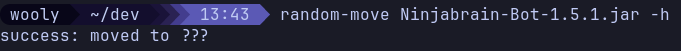

# random-move

bash script that moves your file to a random folder under your current dir


use -h or --hide-dest to hide the new file location from you


## add to your terminal

From the repo directory:

```bash
chmod +x random-move
mkdir -p ~/.local/bin
ln -sf "$(pwd)/random-move" ~/.local/bin/random-move
```
