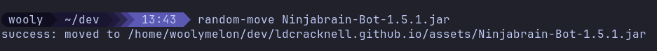

# random-move



bash script that moves your file to a random folder under your current dir

## add to your terminal

From the repo directory:

```bash
chmod +x random-move
mkdir -p ~/.local/bin
ln -sf "$(pwd)/random-move" ~/.local/bin/random-move
```
